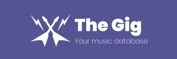

<a href="THIS IS GONNA BE A LINK TO OUR APP"></a>

# The Gig
## Your Music Database

The Gig is a platform that you can use to keep up to date with the music scene.
With this app you can search for bands/artist news, upcoming tours, bio, discography, setlists, or you can just follow the bands you like and have that information personalized and filtered for you. 
Also by keeping track of the events that are happening near your location, hopefully you will never miss a great concert again!

## Getting started

First of all, you need to clone this repo into your local machine, using:

```
git clone https://github.com/ruimak/thegig.git
```

then you will need to install the dependencies, and run the project locally:

```
npm install
npm start
```

## Running the tests

The gig has been tested using Cypress.

The tests written make sure the right endpoints are hit when navagating throughout the app. We also test the right amount of articles,songs,and albums are displayed and error pages are being diplayed when a user types in the wrong url.

To run the tests, type into your terminal:

```
node_modules/.bin/cypress open

```

Click on  the app_spec.js file. This is where all the tests for the app live.

Make sure you have the app running by typing npm start in the terminal, then you can run the tests in the file.

Put a .only infront of any describe block, this will run tests only for that specific block.


## Known issues

Because we havent subscribed to paid features in apis, some requests may take a little longer to arrive. An easy solution would be to subscribe.
The same goes for the billboards. We have used a free heroku plan to host a backend API, and therefore it takes a while to get those bloody charts back!

## Future features

* **Styling:** Having set a deadline of 3 weeks for our project, we didnt had enough time to style the app as much as we wanted. Definitely would be our first priority.
* **User Profiles:** Soon we will have user profiles in the app. That means that you will be able to search for and add friends, see the songs that they've heard, share songs on your feed, have a timeline for your friends updates, like and comment and much more.
* **Integrated music player:** We want to be able to implement a Deezer music player in our app, using Redux. That way you will be able to play songs while browsing the list, create playlists or even add songs to your own Deezer playlist.
* **Integrated Content:**Displaying articles and events in the app, instead of redirecting.
* **Mobile App:**Because we have some experience working with React Native, we would enjoy creating a version of this app for mobile.

## Built with
* [MaterialUI](https://material-ui.com/) - The design framework used
* [React](https://reactjs.org/) - Library used to build the app

## Authors

* **Daniel Flaskett**
* **Rui Mak**

## Acknowledgments

* Thanks to Northcoders for giving us excellent tools and especially training us on the art of self-teaching, it will definitely be a really important skill to have in the future.
